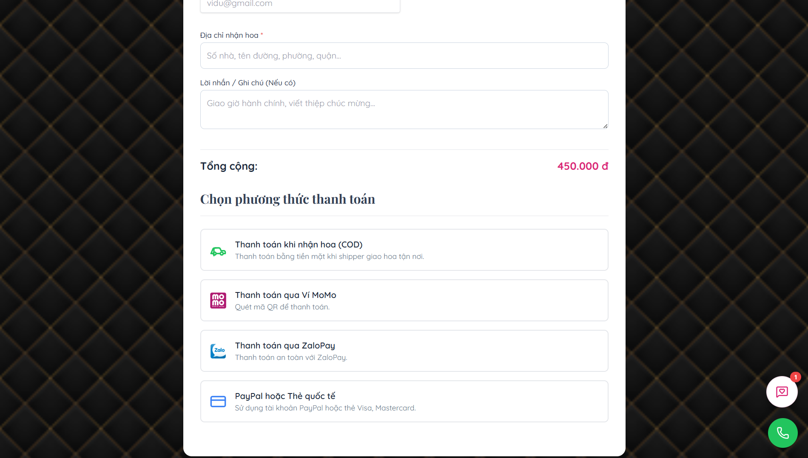
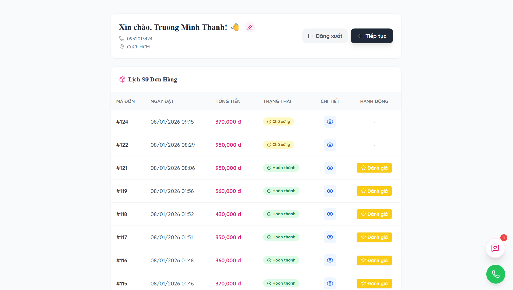
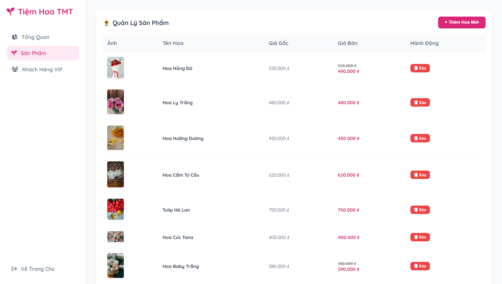
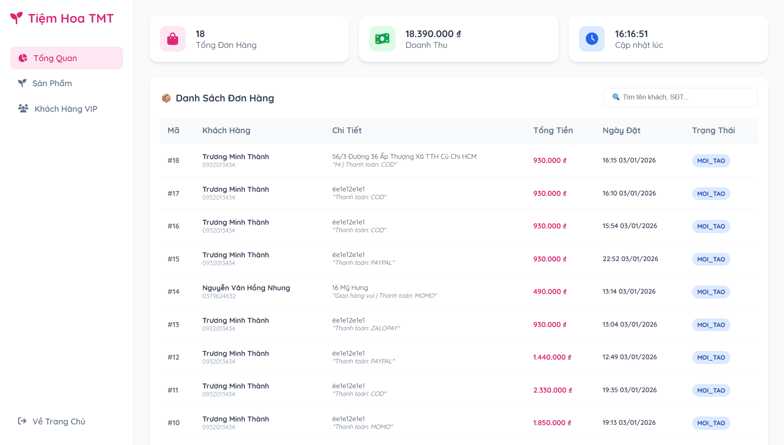
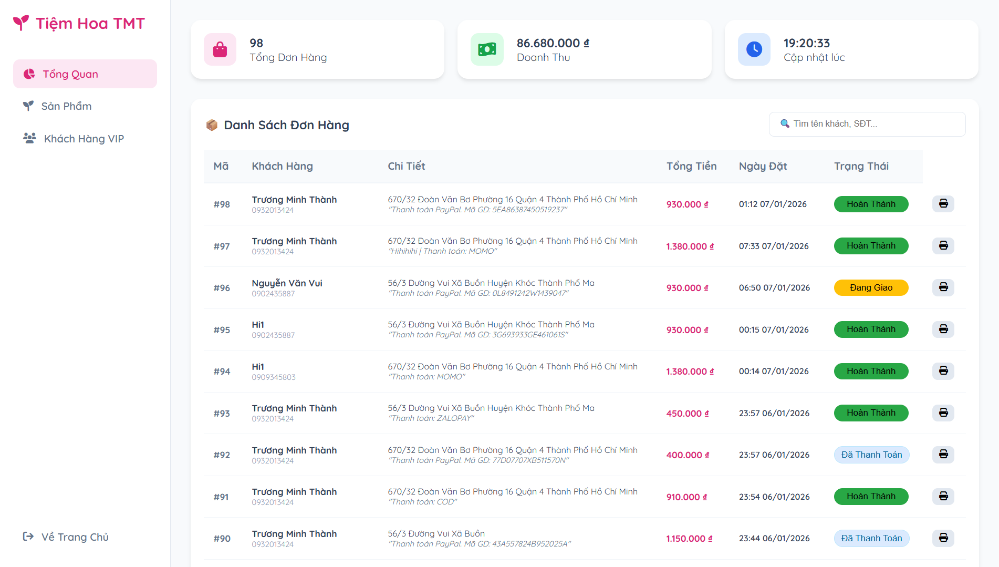

# 🌸 Tiệm Hoa TMT - Hệ Thống Thương Mại Điện Tử Hoa Tươi


## 📖 Giới Thiệu

**Tiệm Hoa TMT** là một giải pháp E-commerce trọn gói dành cho kinh doanh hoa tươi. Hệ thống tích hợp **ChatBot (AI)** để tư vấn, quy trình thanh toán quốc tế (**PayPal**) và hệ thống quản trị vận hành mạnh mẽ.

Phiên bản hiện tại đã hoàn thiện quy trình **Authentication (Đăng nhập/Đăng ký)**, quản lý **Hồ sơ khách hàng (Profile)** và **Đồng bộ trạng thái đơn hàng Real-time** giữa Admin và User.

---

## 📸 Sản Phẩm

### 1. Phân Hệ Khách Hàng (Customer)

| Trang Chủ & Chatbot AI | Đăng Nhập & Đăng Ký |
| :---: | :---: |
|  |  |
| *Giao diện hiện đại, Bot tư vấn thông minh* | *Bảo mật với Spring Security* |

| Thanh Toán & Contact | Lịch Sử Đơn Hàng (Profile) |
| :---: | :---: |
|  |  |
| *Tích hợp PayPal, QR Code, Widget liên hệ* | *Theo dõi trạng thái đơn hàng Real-time* |

### 2. Phân Hệ Quản Trị (Admin)

| Dashboard Thống Kê | Quản Lý Đơn Hàng & Sản Phẩm |
| :---: | :---: |
|  |  |
| *Tổng quan doanh thu, đơn hàng* | *Cập nhật trạng thái, In hóa đơn, Upload ảnh Cloud* |

---

## 🚀 Tính Năng Nổi Bật (Key Features)

### 👤 1. Trải Nghiệm Người Dùng & Thành Viên
* **🔐 Authentication & Security:**
    * Đăng ký/Đăng nhập bảo mật (BCrypt Password Encoding).
    * Phân quyền chặt chẽ (Role-based: USER vs ADMIN).
    * Chặn truy cập trái phép vào trang quản trị.
* **👤 User Profile & History:**
    * Trang cá nhân hiển thị lịch sử mua hàng.
    * **Đồng bộ trạng thái:** Khi Admin đổi trạng thái (VD: *Đang giao*), khách hàng thấy ngay lập tức trên trang Profile.
* **🛒 Giỏ Hàng Thông Minh:**
    * Lưu trữ LocalStorage (F5 không mất dữ liệu).
    * Cập nhật số lượng, tính tổng tiền tự động.

### 🤖 2. Trợ Lý Ảo & Hỗ Trợ
* **AI Florist Chatbot:**
    * Phân tích nhu cầu (Tặng sinh nhật, Tỏ tình, Ngân sách...).
    * Gợi ý sản phẩm kèm hình ảnh và giá ngay trong khung chat.
    * Hoạt động xuyên suốt các trang (Trang chủ, Thanh toán, Profile).
* **📞 Widget Contact Đa Kênh:**
    * Nút gọi điện/Zalo/Facebook tích hợp sẵn, hiển thị mọi lúc mọi nơi.

### 💳 3. Thanh Toán & Đơn Hàng
* **Phương Thức Đa Dạng:**
    * **PayPal:** Tích hợp API thật, tự động cập nhật trạng thái "Đã thanh toán".
    * **QR Code:** Giả lập quét mã Momo/ZaloPay.
    * **COD:** Thanh toán khi nhận hàng.
* **Email Automation:** Tự động gửi Email xác nhận chi tiết đơn hàng ngay khi đặt thành công.

### 🛡️ 4. Hệ Thống Quản Trị (Admin)
* **Cloud Storage:** Upload ảnh sản phẩm lên **Cloudinary**, giảm tải cho server.
* **Order Management:**
    * Xem danh sách, tìm kiếm đơn hàng.
    * Đổi trạng thái đơn (Mới tạo -> Đã thanh toán -> Đang giao -> Hoàn thành).
    * **In hóa đơn:** Xuất hóa đơn bán lẻ trực tiếp.

---

## 🛠️ Công Nghệ Sử Dụng (Tech Stack)

| Lĩnh Vực | Công Nghệ | Mô Tả |
| :--- | :--- | :--- |
| **Backend** | Java 21, Spring Boot 3.x | Core framework mạnh mẽ. |
| **Security** | Spring Security | Quản lý xác thực và phân quyền. |
| **Database** | MySQL / PostgreSQL | Lưu trữ dữ liệu (Local & Cloud). |
| **ORM** | Spring Data JPA, Hibernate | Giao tiếp Database. |
| **Frontend** | Thymeleaf, HTML5, TailwindCSS | Giao diện Responsive. |
| **Scripting** | **Vanilla JS (Modular)** | Cấu trúc JS tách biệt (`admin.js`, `chatbot.js`, `contact.js`...). |
| **Cloud** | Cloudinary API | Lưu trữ hình ảnh. |
| **DevOps** | Docker, GitHub Actions, Render | CI/CD Pipeline & Deployment. |

---

## 📂 Cấu Trúc Dự Án (Modular Architecture)

Dự án được tổ chức theo mô hình MVC, tách biệt rõ ràng giữa Static Resources (JS/CSS) và Templates.

```plaintext
TIEM-HOA-TUOI
├── src/main/java/com/tmt/tiem_hoa_tuoi
│   ├── config       # SecurityConfig, WebConfig
│   ├── controller   # AuthController, OrderController, PayPalController, AdminController...
│   ├── entity       # User, FlowerOrder, Product...
│   ├── repository   # JPA Interfaces
│   └── service      # EmailService, PayPalService, CloudinaryService
├── src/main/resources
│   ├── static       # Tài nguyên tĩnh (Public)
│   │   ├── css      # admin.css, index.css, thanhtoan.css (Separated Styles)
│   │   ├── js       # admin.js, chatbot.js, contact.js, index.js (Modular JS)
│   │   ├── images   # Assets
│   │   └── asset    # Âm thanh thông báo
│   ├── templates    # Giao diện (Thymeleaf)
│   │   ├── admin.html
│   │   ├── index.html
│   │   ├── login.html
│   │   ├── register.html
│   │   ├── profile.html
│   │   └── thanhtoan.html
│   └── application.properties
├── Dockerfile       # Containerization
├── docker-compose.yml
└── pom.xml


👨‍💻 Tác Giả
Trương Minh Thành

Sinh viên Kỹ Thuật Phần Mềm - Năm 2

Đam mê: Cloud Engineering, DevOps, Full-stack Java.

GitHub: github.com/thanhpino

Email: tt3145539@gmail.com

Project made with ❤️ and lots of coffee.